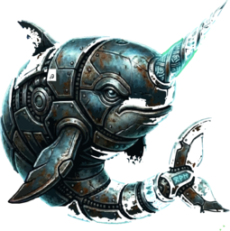

<p align="center">
  
</p>

<h1 align="center">navra</h1>

<p align="center">
  Secure agentic AI framework for Rust
</p>

<p align="center">
  <a href="#features">Features</a> ·
  <a href="#quickstart">Quickstart</a> ·
  <a href="#agent-sdk">Agent SDK</a> ·
  <a href="#flows">Flows</a> ·
  <a href="#model-serving">Model Serving</a> ·
  <a href="#architecture">Architecture</a> ·
  <a href="#security">Security</a> ·
  <a href="#agent-bundles">Bundles</a> ·
  <a href="#documentation">Docs</a> ·
  <a href="#license">License</a>
</p>

---

**navra** is a 24-crate Rust workspace that combines an MCP gateway,
an agent SDK, and a multi-agent flow engine behind a unified security
layer. Information Flow Control, deny-wins ACLs, content safety
filters, credential brokering, and human-in-the-loop approval are
enforced at the infrastructure level — not by trusting the model.

```
AI Agent (Claude Code, Goose, Rust SDK, ...)
    │
    │  MCP / ACP / OpenAI-compat / WebSocket / stdio
    ▼
navra gateway
    ├── Auth (BLAKE3 tokens, Ed25519 capability tokens with delegation)
    ├── Permission engine (path ACLs, domain rules, per-tool policies, privilege rings)
    ├── Information Flow Control (2×4 product lattice, Bell-LaPadula)
    ├── 22 hook types (pre/post tool-call and model-call, safety, egress)
    ├── Safety filters (8 profiles, regex + NER + ML, pseudonymization, canary tokens)
    ├── Tool scanner (8 threat categories for upstream supply-chain defense)
    ├── Credential brokering (keyring/env — agents never see secrets)
    ├── Audit blackbox (SHA-256 hash chain, tamper-evident)
    ├── Built-in modules (RAG, voice, vision, cognitive, memory)
    ├── Upstream MCP aggregation (stdio, HTTP, SSE)
    ├── OpenAPI/Swagger-to-MCP bridge with OAuth
    └── Model proxy (OpenAI-compat /v1/chat/completions + /v1/messages)

navra-agent (Rust SDK)
    ├── ReAct tool-use loop with circuit breakers
    ├── 6 model backends (OpenAI-compat, Anthropic, OGX, ONNX, CLI, safe wrapper)
    ├── Signals (pause/resume/interrupt/terminate), hibernation, replay
    └── Containerized execution (Podman, OpenShell)

navra-flow (orchestration)
    ├── DAG execution with dynamic task generation
    ├── Handoff routing (model-driven agent transitions)
    ├── Mesh communication (mailbox, blackboard with IFC)
    ├── Event-driven triggers (cron, webhook, file-watch)
    └── Checkpoint/recovery, self-harness
```

## Features

### Gateway

- **MCP 2026-07-28 + ACP v0.2.0** protocol support
- **4 transports** — Streamable HTTP, WebSocket, stdio, Unix socket
- **OpenAI-compatible model proxy** — `/v1/chat/completions` + `/v1/messages` (Anthropic format)
- **Upstream MCP aggregation** with stdio, HTTP, and SSE transports
- **OpenAPI/Swagger-to-MCP bridge** — expose any REST API as MCP tools, with OAuth
- **`navra wrap`** — one command to put a secure gateway around any MCP server
- **System tray** (ksni) + D-Bus notifications for session control
- **Systemd integration** with socket activation
- **Config hot-reload**, Prometheus metrics, optional OpenTelemetry traces

### Security

- **Information Flow Control** — 2x4 product lattice (Bell-LaPadula no-write-down)
- **BLAKE3 token auth + Ed25519 capability tokens** with delegation chains
- **Deny-wins ACLs** — path rules, domain rules, per-tool policies, privilege rings
- **22 hook types** — pre/post for tool-call and model-call, plus safety and egress hooks
- **Content safety** — 8 profiles, regex + NER + ML filters, pseudonymization, canary tokens
- **Tool scanner** — 8 threat categories for upstream MCP supply-chain defense
- **Rate limiting** (token bucket), statistical guardrails, temporal behavioral contracts
- **Credential brokering** — keyring/env injection; agents never see raw secrets
- **Audit blackbox** — SHA-256 hash chain (tamper-evident), structured event log
- **Human-in-the-loop approval** — 4 channels: MCP, D-Bus, system tray, CLI

### Agent SDK

- **ReAct tool-use loop** with configurable circuit breakers
- **6 model backends** — OpenAI-compatible, Anthropic, OGX, ONNX, CLI, safe wrapper
- **Signals** — pause, resume, interrupt, terminate
- **Hibernation** and **deterministic replay** for debugging
- **Containerized execution** via Podman or OpenShell sandboxes

### Flows

- **DAG execution** with parallel tasks, dependency resolution, dynamic task generation
- **Handoff routing** — model-driven agent transitions
- **Iterative analysis** — scout-map-reduce patterns
- **Mesh communication** — mailbox, blackboard (IFC-enforced), back-edges, cross-validation
- **Event-driven triggers** — cron schedules, webhooks, file-watch
- **Checkpoint/recovery** and self-harness for long-running workflows

### Cognitive

- **Persona factory** (ForgeService + Weaver) with YAML-defined personas
- Heuristics, directives, specializations, skill cards per persona
- Per-phase model routing, context budget management
- Upstream persona auto-discovery
- `navra persona new/list` CLI commands
- SHA-256 integrity verification

### Memory

- **Working memory** with forking and merging
- **Knowledge store** — FTS5 search, scoped, temporal validity, GDPR consent tracking
- **Entity graph** — triple store with 2-hop traversal
- **Distillation pipeline** — LLM or stub-based extraction

### RAG

- **Hybrid search** — FTS5 + sqlite-vec with Reciprocal Rank Fusion
- **Cross-encoder reranking** with confidence gating
- **Agentic retrieval** — query decomposition, self-correction loops
- **Semantic query cache**

### Model Serving

- **4 isolation modes** — embedded llama.cpp, direct, Podman, OpenShell
- **Hardware auto-detection** — NVIDIA/AMD/Intel GPU, Intel NPU, RAM
- **Model hub** — `ollama://`, `hf://`, `oci://`, `file://` URIs
- **KV cache quantization** — F16, Q8_0, Q4_0 via llama-cpp-4
- **Speculative decoding**, LRU hot-swap pool
- **Standalone or embedded** model server

### Modalities

- **Voice** — ASR (speech-to-text) + TTS (text-to-speech)
- **Vision** — image understanding, OCR

## Quickstart

```bash
git clone https://github.com/smgglrs-ai/navra.git && cd navra
cargo build --release
cp target/release/navra ~/.local/bin/

# Interactive setup
navra init

# Start the gateway
navra mcp serve
```

`navra init` detects your agent (Claude Code, Goose), recommends
MCP servers for your project type, generates a token, writes config,
and optionally installs a systemd service.

### Integration guides

Step-by-step guides for connecting popular agents and clients:

- [navra + Claude Code](docs/content/docs/integrations/claude-code.md)
- [navra + Goose](docs/content/docs/integrations/goose.md)
- [navra + OpenAI clients (Python/Node)](docs/content/docs/integrations/openai-clients.md)
- [navra + LangGraph](docs/content/docs/integrations/langgraph.md)
- [navra + OpenAPI services](docs/content/docs/integrations/openapi.md)
- [navra + custom MCP client](docs/content/docs/integrations/custom-mcp.md)

## Agent SDK

Build agents in Rust with `navra-agent`:

```rust
use navra_agent::{Agent, OpenAiBackend, Locality};

#[tokio::main]
async fn main() -> anyhow::Result<()> {
    let model = OpenAiBackend::new(
        "http://localhost:11434/v1", "granite3.3:8b",
        None, Locality::Local,
    );

    let mut agent = Agent::builder()
        .endpoint("http://localhost:9315/mcp").await?
        .model(model)
        .system_prompt("You are a helpful assistant.")
        .auth_token("mcd_your_token_here")
        .max_iterations(20)
        .build().await?;

    let result = agent.run("List the git status").await?;
    println!("{}", result.response);
    Ok(())
}
```

Works with Ollama, Mistral, Anthropic, any OpenAI-compatible API,
or a local CLI command. See [examples/standalone-agent/](examples/standalone-agent/)
for a complete runnable example.

## Flows

Define multi-agent workflows in YAML:

```yaml
kind: dag
name: deep-research
tasks:
  - id: search
    specialist: researcher
    mandate: "Search multiple sources about..."
  - id: verify
    specialist: devils_advocate
    depends_on: [search]
    mandate: "Adversarially verify each claim..."
  - id: synthesize
    specialist: summarizer
    depends_on: [verify]
    mandate: "Produce a cited report with only verified findings..."
```

Included flows: [review](examples/flows/review.yaml),
[deep-research](examples/flows/deep-research.yaml),
[security-audit](examples/flows/security-audit.yaml),
[improve](examples/flows/improve.yaml),
[self-improve](examples/flows/self-improve.yaml).

## Model Serving

navra embeds llama.cpp for zero-dependency local inference and
manages models through a unified hub supporting `ollama://`, `hf://`,
`oci://`, and `file://` URIs. Hardware is auto-detected (NVIDIA, AMD,
Intel GPU/NPU, RAM) to select the right runtime. Four isolation modes
(embedded, direct, Podman, OpenShell) let you trade convenience for
sandboxing.

```bash
# Pull and serve a model
navra model pull ollama://granite3.3:8b
navra model serve

# Or use the gateway's embedded model server
navra mcp serve   # models configured in config.toml are served automatically
```

## Architecture

24-crate Rust workspace organized in strict dependency layers:

```
navra-protocol          (no internal deps)
navra-model             (protocol)
navra-auth              (protocol)
navra-safety-hooks      (auth)
navra-memory            (protocol)
navra-rag               (protocol + model + memory)
navra-cognitive         (protocol + model)
navra-core              (protocol + model + auth + safety + rag + cognitive)
navra-agent             (protocol + model + auth + cognitive)
navra-flow              (agent + core)
navra-server            (all crates)
```

See [DESIGN.md](DESIGN.md) for the full crate table, dependency graph,
and design decisions.

## Security

- **Information Flow Control** — taint labels track data sensitivity
  across tool calls. Tainted sessions cannot write to lower-classification
  outputs (Bell-LaPadula no-write-down).
- **Deny-wins ACLs** — deny rules always beat allow rules. Path
  canonicalization prevents traversal.
- **22 hook types** — pre/post tool-call, pre/post model-call, safety,
  and egress hooks form a pipeline that cannot be bypassed.
- **Tool scanner** — scans upstream MCP tool definitions for 8 threat
  categories before exposing them to agents.
- **Credential brokering** — secrets from keyring or environment are
  injected at call time; the agent session never sees raw credentials.
- **Formal verification** — Kani proofs, Verus files, and
  TLA+ specs verify critical safety invariants.
- **Adversarial security tests** — covering ACL bypass, IFC laundering,
  prompt injection, hook pipeline abuse, approval replay, and
  cross-session isolation.

## Agent Bundles

```bash
navra agent install oci://quay.io/navra/researcher:latest
navra agent inspect oci://quay.io/navra/code-reviewer:latest
navra agent list
```

See [examples/agent-bundles/](examples/agent-bundles/) for reference
manifests.

## CLI

```
navra init             Interactive setup (agent detection, config, systemd)
navra mcp serve        Start the MCP gateway (Streamable HTTP)
navra mcp stdio        Start the MCP gateway (stdio transport)
navra wrap             Secure-wrap any MCP server in one command
navra agent run        Run an agent from a bundle or inline
navra flow run         Execute a multi-agent flow
navra persona new      Create a new persona from a prompt
navra persona list     List available personas
navra model serve      Start the standalone model server
navra model pull       Download a model from the hub
navra eval             Run evaluation benchmarks
navra self-harness     Self-assessment harness
navra tui              Terminal UI for session monitoring
navra demo             Interactive demo mode
```

## Documentation

- [Getting Started](docs/content/docs/getting-started/) — installation and first run
- [Configuration](docs/content/docs/configuration/_index.md) — complete config reference
- [SDK Guide](docs/content/docs/sdk/) — building agents with navra-agent
- [Security](docs/content/docs/security/_index.md) — security model deep-dive

Guides:

- [Wrap](docs/content/docs/guides/wrap.md) — secure-wrapping any MCP server
- [Teams](docs/content/docs/guides/teams.md) — multi-agent team configuration
- [Approval](docs/content/docs/guides/approval.md) — human-in-the-loop setup
- [Safety](docs/content/docs/guides/safety.md) — content safety profiles
- [Credentials](docs/content/docs/guides/credentials.md) — credential brokering
- [Audit](docs/content/docs/guides/audit.md) — audit blackbox and event log
- [Triggers](docs/content/docs/guides/triggers.md) — event-driven flow triggers
- [Personas](docs/content/docs/guides/personas.md) — cognitive persona system
- [Memory](docs/content/docs/guides/memory.md) — working memory and knowledge store
- [RAG](docs/content/docs/guides/rag.md) — retrieval-augmented generation
- [Model Server](docs/content/docs/guides/model-server.md) — local model serving
- [Flows](docs/content/docs/guides/flows.md) — multi-agent flow orchestration

Reference:

- [DESIGN.md](DESIGN.md) — full architecture and security model
- [CONTRIBUTING.md](CONTRIBUTING.md) — contribution guidelines
- [SECURITY.md](SECURITY.md) — vulnerability disclosure
- [examples/](examples/) — configs, flows, agent bundles, standalone agent

## License

[Apache License 2.0](LICENSE)
